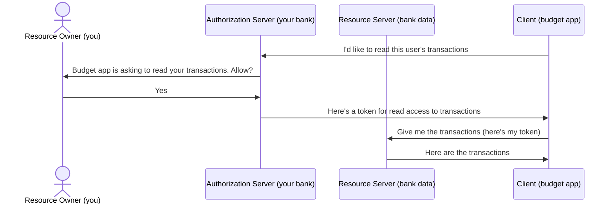
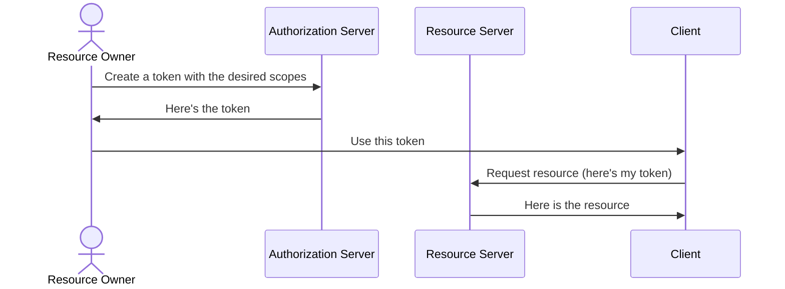
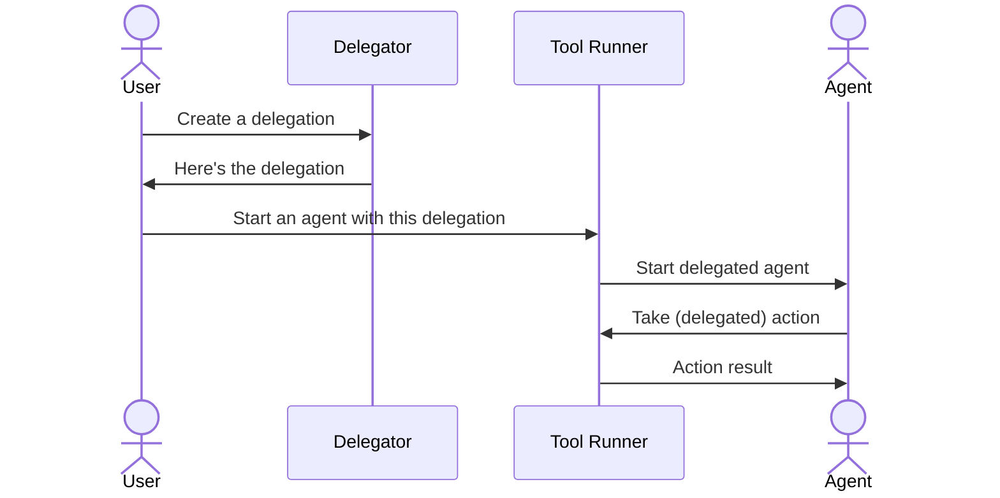
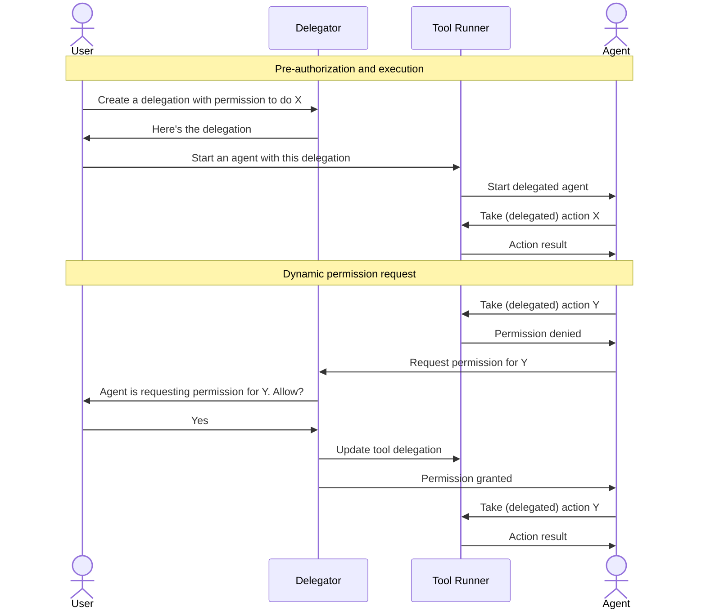

# What AI harnesses should learn from OAuth

Agent harnesses think of agents wrong, and it shows in how they approach security. They seem to be thinking of agents as tools to help developers get work done faster. And agents do that, but it's the wrong mental model. I really appreciated [this article from Finbarr Taylor](https://finbarr.site/2026/05/05/treat-your-coding-agents-like-developers.html) that articulates this challenge well.

And it's not just agents that can be thought of this way. When we build an API integration, we're treating someone else's program as an actor, or a principal. The analog of a person. That's the right lens for AI agents too. The same security concepts you use for people or software as a service applies to agents as well.

The problem that we need to solve is *constrained delegation*. And while the full problem is ultimately very domain-specific, a very good model for delegation is already in wide use. OAuth is the preferred way to do this type of delegation between services. And we can learn from it to show us how to do agent and subagent delegation better.

## The credential sharing problem

Without delegation like OAuth implements, the only recourse to having an integration is to share credentials. This is the reason that some integrations, like pulling data from your bank account to get into budget software, can have to ask you to enter your username, password, and security questions. Because the bank doesn't implement a more secure way to delegate access, the only thing left is simply acting directly as you, and doing what you can do on the website. You have to trust that it will do what you want it to do, and nothing more.

OAuth provides a way for another service to have its own credentials that the service understands, but become authorized to act on your behalf. The mechanism itself has built-in capability for allowing the service acting on your behalf to declare what it wants to do, so that you can see what it's requesting access to and can authorize that delegation (or not).

## The four roles

OAuth defines four roles relevant to our conversation today. The way these roles interact can help us understand how agents could do something similar.

- **Resource Owner**: The resource owner is, in our bank example, you. The user that wants to authorize your budget app to see your bank data.
- **Client**: The client is the budget app that would like to access your bank data.
- **Authorization Server**: The authorization server handles managing the delegation. This is the central broker of the magic of OAuth's delegation.
- **Resource Server**: The resource server is where the protected data actually lives. It takes the authorization that the authorization server proved, and it fulfills requests for the sensitive data.

### Scopes

Now, in this drawing is another key aspect to delegation we haven't called out yet. The client is telling the authorization server exactly what it wants to do. When it gets approval, it's only to do what has been asked. It can view transactions, but it's not allowed to make transfers to other accounts, for example.

Scopes are how it does it. Scopes are not intuitive to get your head around, in my opinion, because they don't really match up to anything you normally think about in permissions. You normally think about:

* types of actions you can take, like "read transactions" or "make transfers"
* limitations of particular resources "read transactions for my checking account only"
* limitations of properties, like "read transactions from the past 30 days only"

But scopes aren't really any of those. The first is a very common way to _use_ scopes, but it's not the definition of what a scope is. That's because scopes don't actually have any specific definition at all. It doesn't require that it be for a particular resource, or have properties, or do specific actions, or any combination of those.

A scope is a string, and the authorization server can use whatever semantics it likes for that string. They could support actions like "list_transactions, transfer_money", but they could also make something more complex that would need to be parsed, like "checking:list_transactions" to limit it to your checking account, or "list_transactions:30_days" to limit to the last 30 days. The only limit to how specific or general it can be is the imagination of the designers of the scopes that they support, and they ways in which those scopes can be communicated and validated.

## A closer analog: Personal Access Tokens

This flow isn't quite aligned with what we usually do with an AI agent. A better example might be a personal access token (PAT), which is generated by a user, and the user is responsible for giving the token to the client.

## Adapting it for AI harnesses

And now we can translate that structure to how it looks with an AI agent.

In this diagram, the agent itself is considered more like a user than a program. This reflects that key insight mentioned earlier, that the best way to work with an AI agent is to treat it similarly to a human user.

For OAuth, it's common for an Authorization Server and Resource Server to be the same entity. The same is true for the Delegator and Tool Runner. It's likely that both roles are taken by the harness itself.

And while the "user" actions in this diagram will often be pragmatically taken by the harness without user involvement, this flow leads us naturally to extend it to not just one agent, but to subagents by chaining permission delegation, where the agent in this diagram becomes the "user" in the subagent's delegation flow. Unlike users, agents don't need the shortcuts that users would want. Each agent, as they are delegating to a sub-agent, can reasonably be required to determine what scopes should be delegated to the agent.

Current harnesses almost follow this flow for user to agent delegation, except that the tools they expose for agent delegation are about setting up agents that have specific permissions, and that other agents are able to call without any respect to whether the originating agent has the permissions to do what they're asking the agent to do. There is usually no capacity for agents to delegate their own permissions to subagents at all.

## What we missed

Thus far we have removed a significant source of complexity, because we expect agents to be delegated permission immediately. But there are good reasons that we'd also like for agents to be able to request addition permission. I think if we did this right, it would be far superior to the current way permission has to be verified by the user.

Most tools that put user permission in the loop do it by pausing the agent when it does something that needs permission. I think this is the wrong way to handle it. It removes *agency* from the agent, rather than merely reflecting the limits of the delegation to the agent.

The better way would be for the tool to tell the agent it doesn't have permission, and tell it what permission (scopes) it needs in order to do what it wants. Then, like an OAuth client would do, it can _choose_ to ask the user (or the parent agent) to approve additional permission.

The agent retains its own agency, and can decide whether it's worth requesting the permission. If an async permission request was made, it could even request permission, but then continue on its way, periodically checking to see if it got the permission it had requested.

## In summary

Here's the quick hits of what commands we need to support this model of agent delegation:

1. (Grantor) Create a delegation, constrained to a subset of its own
2. (Grantor) Start the agent with that delegation
3. (Grantee) Know what actions are possible
4. (Grantee) Invoke a tool under that delegation
5. (Grantee) Handle a permission-denied response without stalling
6. (Grantee) Know what permission would be needed to proceed
7. (Grantee) Request additional permission
8. (Grantor) Receive a permission request from the agent
9. (Grantor) Evaluate it against its own delegation — approve, deny, or escalate up the chain
10. (Grantee) Receive an updated delegation, or rejection notice
11. (Grantee) Invoke the tool under that updated delegation

I believe that starting with this framework at the foundation of the tools provided to AI agents in a default environment that allows no actions, we can build a trustworthy and capable system of AI agents.
